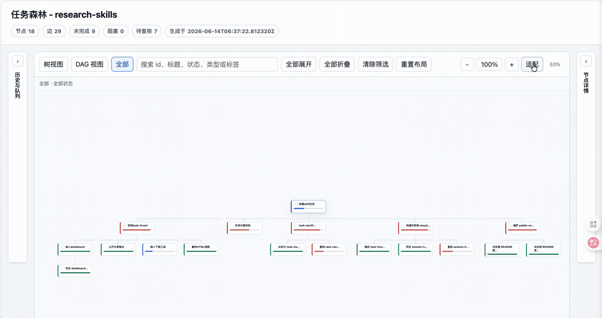
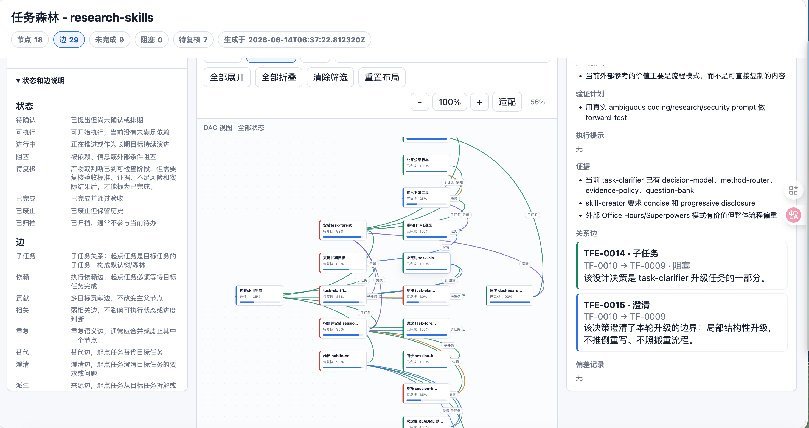
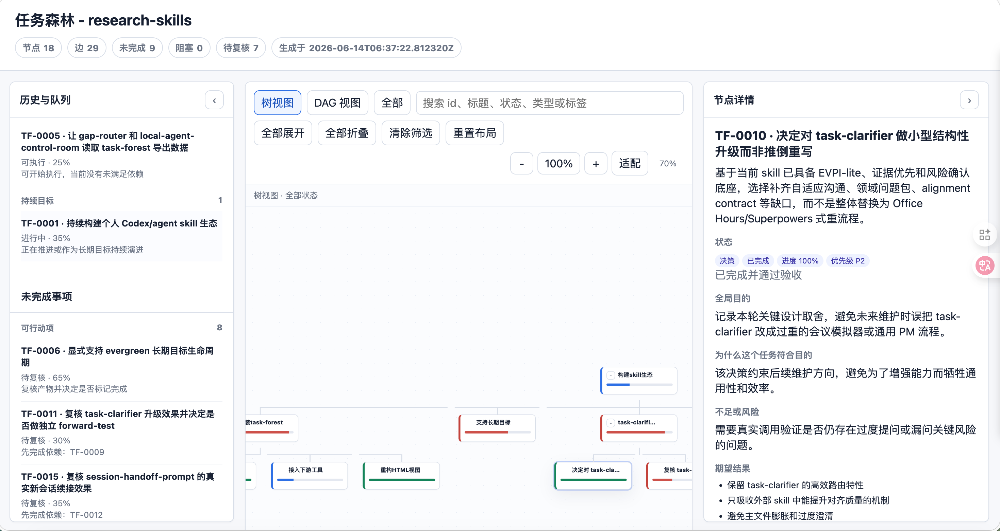
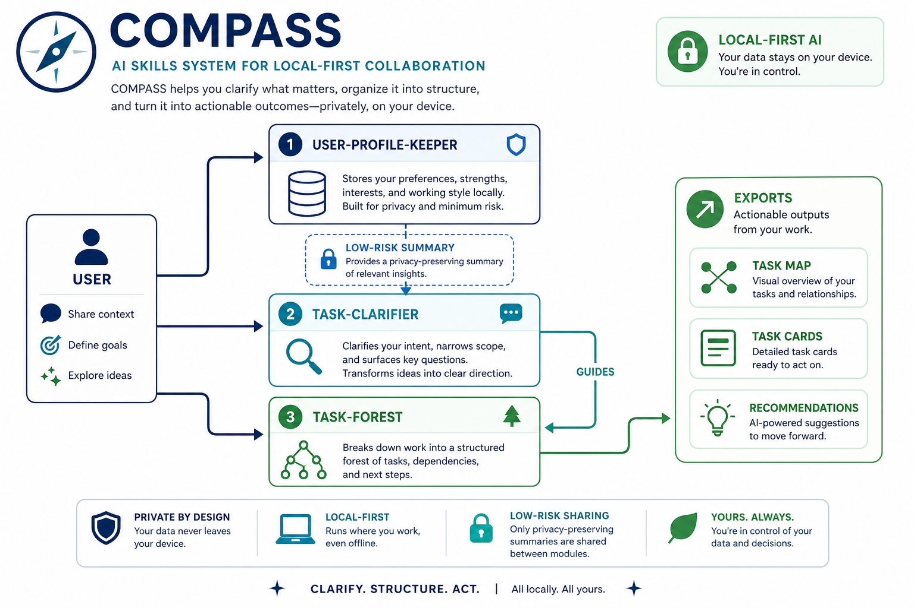
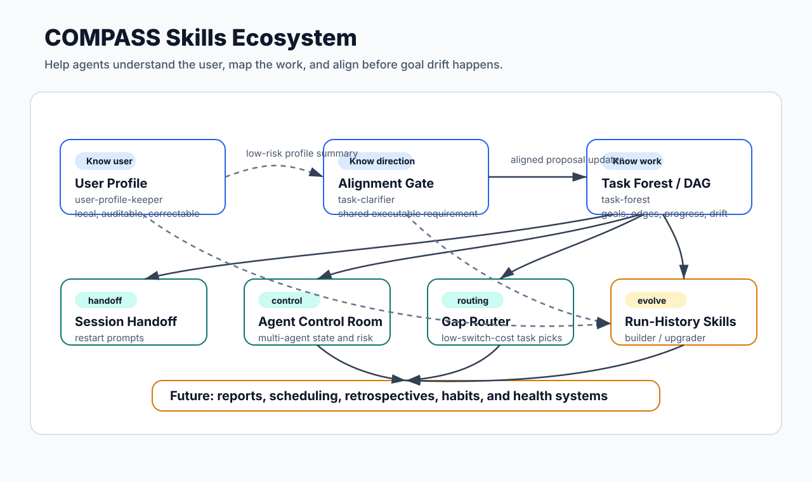

<p align="center">
  
</p>

<h1 align="center">COMPASS Skills</h1>

<p align="center">
  <a href="https://github.com/dongshuyan/compass-skills/stargazers"></a>
  <a href="https://github.com/dongshuyan/compass-skills/forks"></a>
  <a href="LICENSE"></a>
  
  <a href="https://linux.do/"></a>
</p>

<p align="center">
  <a href="README.zh.md">中文</a> · <a href="SECURITY.md">Security</a> · <a href="LICENSE">License</a>
</p>

> **Start here: [Use & develop your own Skill ecosystem](https://dongshuyan.com/compass-skills/skill-writing-tutorial.html)**
>
> A practical tutorial for using `SKILL.md`, auditing reusable skills, drafting skills with AI, extracting real workflows, and building a local Skill ecosystem.

```bash
npx skills add dongshuyan/compass-skills --skill '*' -a claude-code
```

COMPASS Skills gives AI agents nine local skills: five runtime collaboration skills, two run-history skill-engineering skills, one academic humanization skill, and one local hiring-support skill.

The project currently ships nine `SKILL.md` skills:

| Skill | Purpose |
| --- | --- |
| [`task-clarifier`](skills/task-clarifier/) | Aligns goals, scope, evidence, acceptance criteria, and risk boundaries before ambiguous, costly, or externally visible work. |
| [`task-forest`](skills/task-forest/) | Maintains a repo-local task forest / DAG with goals, subtasks, dependencies, progress, deviations, todos, decisions, and conversation history. |
| [`pause-and-resume`](skills/pause-and-resume/) | Cooperatively pauses unfinished work at a safe boundary and resumes it from a precise checkpoint in the same AI conversation. |
| [`session-handoff-prompt`](skills/session-handoff-prompt/) | Compresses the current AI conversation's goal, progress, constraints, and next steps into a paste-ready prompt for a new AI conversation. |
| [`user-profile-keeper`](skills/user-profile-keeper/) | Maintains a local, auditable, correctable collaboration profile for communication preferences, risk style, and recurring working context. |
| [`run-history-skill-builder`](skills/run-history-skill-builder/) | Turns completed or repeatedly refined run history into a new reusable skill package or a reviewed skill-design plan. |
| [`run-history-skill-upgrader`](skills/run-history-skill-upgrader/) | Automatically turns session evidence from real execution, encountered and resolved difficulties, validation results, and user feedback into an upgrade plan for an existing skill, forming the simplest controlled self-evolution loop; it applies changes only after explicit approval. |
| [`academic-humanizer`](skills/academic-humanizer/) | Helps write or revise English and Chinese academic prose by removing formulaic AI-like patterns and restoring a natural scholarly voice while preserving claims, evidence strength, and logical relations. |
| [`assess-interview-candidate`](skills/assess-interview-candidate/) | Turns an authorized resume and job description into an auditable evidence layer and a concise three-part offline interviewer report, with locally sanitized resume portraits and bounded timeline-age estimates kept outside scoring. |

For multi-skill repositories, install only the functions you actually need. Use `pause-and-resume` when the same AI conversation will remain available; use `session-handoff-prompt` when work must move to a fresh conversation. The `run-history` pair supports skill engineering, and `academic-humanizer` improves academic prose without changing its claims.

## Quick Start

List the available skills before installing:

```bash
npx skills add dongshuyan/compass-skills --list
```

Install all skills for Claude Code:

```bash
npx skills add dongshuyan/compass-skills --skill '*' -a claude-code
```

Install all skills for both Codex and Claude Code:

```bash
npx skills add dongshuyan/compass-skills --skill '*' -a codex -a claude-code
```

After installation, invoke the skills directly in an AI conversation:

```text
$task-clarifier
$task-forest
$pause-and-resume
$session-handoff-prompt
$user-profile-keeper
$run-history-skill-builder
$run-history-skill-upgrader
$academic-humanizer
$assess-interview-candidate
```

For manual installation, copy the nine folders under [`skills/`](skills/) into the agent's local skills directory and keep their `references/`, `scripts/`, `assets/`, `evals/`, and `agents/` subdirectories intact.

## Why COMPASS Exists

Long-running agent work needs five kinds of state:

- User context: communication preferences, risk boundaries, recurring omissions, and collaboration style.
- Project context: where the current request fits, what it depends on, and how far it has progressed.
- Goal context: how the current task contributes to the original objective and whether it still matches it.
- Pause context: the safe stopping point, remaining work, non-repeatable effects, and first action when the same AI conversation resumes.
- Handoff context: what a new AI conversation needs to continue the current task without replaying the whole transcript.

COMPASS organizes that state into five local workflows:

1. A local profile that the user can inspect and correct.
2. A repo-local task graph that survives AI conversation boundaries.
3. A cooperative pause checkpoint for continuing in the same AI conversation.
4. A paste-ready continuation prompt for a new AI conversation.
5. A clarification gate before ambiguous or risky execution.

## How The Core And Meta Skills Work Together

`task-clarifier` is the entry point for ambiguous, high-cost, high-risk, evidence-sensitive, or externally visible work. It first identifies the user-owned decisions that must be made, asks 1-3 focused questions with recommended answers, confirms shared understanding, and only then searches or executes.

`task-forest` records long-running work structure: why a task exists, where it fits, how far it progressed, what changed, and what remains unresolved.

`pause-and-resume` stops an unfinished task at the nearest safe boundary, records what must and must not be repeated, and continues from that checkpoint when the user returns to the same AI conversation. It creates no file solely for pausing.

`session-handoff-prompt` turns the current AI conversation, explicit transcripts, workspace evidence, and optional task-forest exports into a concise prompt for the next AI conversation. It reads task-forest as structured context but never modifies it.

`user-profile-keeper` stores collaboration preferences locally. Future AI conversations use the profile to ask relevant questions and apply the right risk boundary. Current files, logs, and user-provided context remain the authority; secrets stay out of the profile.

`run-history-skill-builder` turns a completed or repeatedly refined workflow into a new skill package or a plan-only design. If the request is really about changing an existing skill, it hands the job off instead of editing that skill directly.

`run-history-skill-upgrader` takes the next step for existing skills: it automatically reads session evidence from real execution, encountered and resolved difficulties, validation results, and user feedback, then produces a concrete upgrade plan and stops. Only after explicit approval of that plan does it edit files. In practice, this is the simplest controlled self-evolution loop for skills: periodically run a target skill, accumulate real session evidence, then let the upgrader turn that evidence into a reviewed upgrade plan and, after approval, an applied change.

`academic-humanizer` helps authors avoid AI-sounding language while drafting and remove it from existing academic prose. It targets formulaic, vacuous, mechanically repetitive, and process-leaking patterns while protecting claims, evidence strength, quotations, formulas, citations, technical names, modality, logic, and scope. The result aims to read as natural, credible scholarly writing and to reduce the likelihood that readers perceive it as AI-generated; it does not promise a universal authorship judgment.

`assess-interview-candidate` prepares human recruiters for a structured interview. It keeps detailed evidence and validation data in a local audit layer while presenting only a candidate overview, job-relevant resume uncertainties, and 12-18 directly readable questions in the offline HTML. It never authorizes automatic hiring, rejection, or ranking.

```text
user-profile-keeper    -> who is the user and how should we collaborate?
task-forest            -> where does this task fit and is it still aligned?
pause-and-resume       -> where should this AI conversation stop and continue later?
session-handoff-prompt -> what should the next AI conversation know to continue now?
task-clarifier         -> what should the agent do now?
run-history-skill-builder  -> how do we package this proven workflow as a new skill?
run-history-skill-upgrader -> how does a skill self-evolve safely from real session evidence?
academic-humanizer         -> how do we remove AI-sounding prose without changing its claims?
assess-interview-candidate -> how do we prepare a focused, evidence-bounded human interview?
```

## Task Clarifier Example

A vague request is turned into a checked requirement before the agent recommends anything.

<details>
<summary>Example: choosing a suitcase</summary>

Formatted from a live terminal run. Terminal status lines are omitted.

### Turn 1: vague request

**User**

> I want to buy a suitcase, can you tell me which one is the best?

**$task-clarifier**

Before recommending a product, the skill turns "best" into concrete decision criteria:

1. **Use case** — What will you use the suitcase for most?
   - Options: business travel, leisure vacations, extended travel, or custom situation.
   - Recommendation: start with the primary use case, because it changes size, weight, and feature priorities.
2. **Budget** — What price range is realistic?
   - Options: under $100, $100-300, $300-600, $600+, or custom budget.
   - Recommendation: $100-300 is often the best durability-to-cost range for most travelers.
3. **Meaning of "best"** — Which priority wins?
   - Options: durability, light weight, price, warranty/service, organization, or custom priority.
   - Recommendation: durability is the most universal priority.

**User answer**

> 1A 2C 3A
>
> Business travel, $300-600, maximum durability.

### Turn 2: narrow the product class

**$task-clarifier**

The first answers narrow the problem, but two choices still change the recommendation:

1. **Bag type** — Carry-on or checked bag?
   - Recommendation: carry-on for most business trips, faster airport flow, and lower damage risk.
2. **Material** — Hard shell or soft-sided?
   - Recommendation: hard shell for durability and professional appearance.

**User answer**

> Checked bag, hard shell.

### Turn 3: resolve the final size

**$task-clarifier**

One last decision remains:

1. **Checked-bag size** — Compact, medium, or full-size?
   - Recommendation: 26-27 inches handles many business trips without becoming oversized.

**User answer**

> 28 inches.

### Confirmed requirement

**$task-clarifier**

> You need a checked suitcase for frequent business travel. The bag should be hard-shell for maximum durability and professional appearance, 28 inches for extended trips, and within a $300-600 budget. Durability is your top priority over lighter weight or organizational gimmicks.

**Inferences to confirm**

- Durability means repeated airport handling and 5+ years without major failure.
- Brand, color, wheel type, TSA lock, and warranty length are not yet fixed preferences.
- The next step is specific model recommendations, unless the user prefers an evaluation framework.

</details>

## Screenshots

Task forest HTML export:



Live DAG view:



Task detail view:



User profile and alignment flow:



Ecosystem map:



## Compatibility

COMPASS works across agent runtimes as a `SKILL.md` package with Markdown instructions, YAML frontmatter, optional `references/`, optional `scripts/`, and optional agent metadata.

| Agent / environment | Recommended setup |
| --- | --- |
| Claude Code | Use `npx skills add dongshuyan/compass-skills --skill '*' -a claude-code`, or copy the folders under `skills/` into Claude Code's custom skills directory. |
| Codex | Use the `skills` CLI with `-a codex` when supported by your environment, or use the repo as a local skills source. |
| OpenCode / OpenClaw / other agents | Keep [`AGENTS.md`](AGENTS.md) and load the matching `SKILL.md` first, then use `references/` and `scripts/` as needed. |

The invocation examples use `$skill-name` as a portable explicit reference. Hosts may also use their native syntax, such as `$pause-and-resume` in Codex or `/pause-and-resume` in Claude Code. Agents without native skill routing can follow [`AGENTS.md`](AGENTS.md) and read [`skills/pause-and-resume/SKILL.md`](skills/pause-and-resume/SKILL.md) directly.

`pause-and-resume` is instruction-only: it has no OS path, shell, network, filesystem, or external-tool dependency. It requires the host to retain the current AI conversation across turns, so it does not recover a killed process, a closed conversation whose history is unavailable, or work moved to another conversation.

The scripts use Python standard-library components and run locally. `assess-interview-candidate` requires Python 3.10 or later and uses capability-based instructions instead of fixed Agent tools or installation paths.

## Safety Model

COMPASS keeps runtime data local:

- No upload of task data or user-profile data.
- No browser cookie, token, private key, credential, or session extraction.
- `task-forest` stores task data under the current workspace, usually `.agent-workbench/task-forest/`.
- `pause-and-resume` keeps its checkpoint in the current AI conversation and creates no file solely for pausing. It records non-sensitive continuation facts and must not expose secrets.
- `session-handoff-prompt` is read-only by default. It can validate local handoffs with real workspace paths or redact them for shareable handoffs.
- `user-profile-keeper` stores local profile data under `.compass-skills/user-profiles/v1` by default, or a user-selected `COMPASS_USER_PROFILE_HOME`.
- `run-history-skill-builder` reads only user-authorized workflow history and writes new skill files only to a user-approved local directory.
- `run-history-skill-upgrader` is plan-only by default. It can synthesize real session evidence into an upgrade plan automatically, but it enables a controlled self-evolution loop only after explicit approval of a concrete plan.
- `academic-humanizer` preserves source claims and locked spans, never invents facts or citations, and uses its Python script only for optional read-only diagnostics.
- `assess-interview-candidate` keeps authorized resumes and reports local, excludes contact details and precise addresses from the interviewer view, and prevents age, birthplace, hometown, marital status, or location from entering fit scores or hiring decisions.
- High-risk actions such as deletion, overwrite, publishing, remote writes, credential use, and global configuration changes require explicit confirmation.

Important: `user-profile-keeper` uses local plaintext storage without encryption. Do not store passwords, tokens, private keys, verification codes, or highly sensitive personal data in the profile.

See [SECURITY.md](SECURITY.md) for the security boundary.

## Example Prompts

Clarify a task before execution:

```text
Use $task-clarifier to align the task below.

Task: ...
Material: ...
Constraints: ask user-owned decisions first; infer discoverable facts from files, context, or reliable sources. Ask only questions that change scope, method, evidence, format, safety, or acceptance criteria.
Output: ask 1-3 key questions with recommended answers first; once the core need is clear, restate your understanding in 2-5 lines and ask me to confirm.
```

Maintain the task forest for a workspace:

```text
Use $task-forest to analyze the current AI conversation and maintain the task forest for this workspace.

Goal: create a task-forest proposal from long-running goals, tasks, progress, deviations, risks, decisions, and follow-ups in this AI conversation.
Requirements:
1. Read the current task-forest list and todo first; initialize task-forest if missing.
2. Identify which long-term goal this AI conversation served. If no relation is clear, ask me or create a question/risk node.
3. Save a proposal and show me the planned changes before applying.
4. After approval, apply, validate, export, and report the HTML path.
```

Create a continuation prompt for a new AI conversation:

```text
Use $session-handoff-prompt to create a balanced continuation prompt for a new AI conversation.

Goal: let the next AI conversation continue the current task without replaying the whole transcript.
Requirements:
1. Use the current conversation, explicit files I provide, current workspace evidence, and task-forest exports if present.
2. Keep task-forest read-only; do not save proposals or modify the task graph.
3. Use my language for the prompt. Default to Chinese if unknown.
4. Use privacy=local for this machine. If I ask for a public/shareable handoff, redact local paths and credential-like strings first.
5. Put the paste-ready prompt first, then briefly state mode, sources, and limitations.
```

Pause unfinished work in the current AI conversation:

```text
Use $pause-and-resume to pause this unfinished task at the nearest safe boundary. Record a compact continuation checkpoint in this conversation, do not create a checkpoint file, and stop after telling me to say "continue" when I return.
```

When you return to the same AI conversation, say `continue` or an equivalent phrase. The agent should reconcile mutable state and resume from the recorded first action without repeating completed side effects.

Representative output shape:

```text
You are taking over an AI conversation that has already gone through several rounds. Resume from the context below. If current files or verifiable evidence conflict with this handoff, trust the current evidence.

[Working directory]
<workspace>

[User goal]
Add session-handoff-prompt to COMPASS as an official skill that works on macOS, Linux, Windows, and major agent hosts.

[Required constraints]
- [Verified] Internal instructions are in English; interaction and output use the user's language, defaulting to Chinese when unknown.
- [Verified] Do not read credentials, cookies, browser sessions, or unrelated private logs.

[Next step]
1. Update the README and manifest.
2. Run the smoke test and security scan.
3. Report validation results and remaining risks.
```

Initialize a local user profile:

```text
Use $user-profile-keeper to initialize my local user profile.

Goal: build an auditable, correctable, retractable profile from a local questionnaire or the current context.
Boundaries:
1. Store locally only. Do not upload anything or read browser cookies, tokens, or credentials.
2. Do not save secrets, passwords, private keys, verification codes, or browser-session information.
3. Put inferred, private, sensitive, or conflicting claims into pending proposals for my review.
4. Report what was saved, proposed, skipped, or redacted.
```

Remove AI-sounding language from academic prose without changing its claims:

```text
Use $academic-humanizer to remove AI-sounding language from the academic passage below.

Preserve every claim, number, citation, comparison, hedge, causal relation, and scope boundary. Keep quotations, formulas, code, references, statistical notation, proper nouns, and requested verbatim text unchanged. Remove only unsupported, vacuous, mechanically repetitive, or process-leaking wording. Return the clean revised passage without an editor preface.

Passage: ...
```

Prepare a structured candidate interview report:

```text
Use $assess-interview-candidate with the authorized resume and job description I provide.

Requirements: read every page of the PDF through both text extraction and visual inspection; keep the detailed evidence and validation data in the local audit layer; make the interviewer HTML contain only a candidate overview, job-relevant resume uncertainties, and 12-18 directly readable questions. Display candidate-provided schools, employers, and cities without guessing missing facts. Keep age, birthplace, hometown, marital status, and location out of fit scores and hiring decisions. Write only below the local case root I approve.
```

## Validation Status

The public install path has been validated with `skills@1.5.11`:

- `npx skills add dongshuyan/compass-skills --list` finds the released skills.
- `npx skills add dongshuyan/compass-skills --skill '*' -a claude-code --copy -y` installs the released skills into a temporary project's `.claude/skills/` directory.
- `python3 skills/session-handoff-prompt/scripts/smoke_test_handoff.py --skill-dir skills/session-handoff-prompt` validates compacted-event projection, task-forest read-only summaries, local validation, and shareable redaction.
- `printf '%s\n' 'Samples were randomized.' | python3 skills/academic-humanizer/scripts/metrics.py - --json` provides read-only descriptive diagnostics for language routing, process leaks, and contrast candidates without assigning an authorship or quality score.
- With `skills@1.5.23`, the current local source is detected as nine skills; `pause-and-resume` copies successfully into temporary Codex and Claude Code skill roots with byte-identical `SKILL.md` files.
- `pause-and-resume` passes the Skill validator. Its published file is byte-identical to the source used for the completed Codex pause/resume behavior tests.
- `assess-interview-candidate` has 77 passing unit and public-package tests on Python 3.11 and 3.14. It also passes the Skill validator, Ruff, JSON parsing, Python 3.10 syntax parsing, JavaScript syntax checking, and offline report contract validation. An independent live-browser visual pass for the portrait layout remains pending.
- Windows and Linux compatibility is enforced through path, launcher, standard-library, reserved-filename, and shell-neutral contracts. This release was not run on physical Windows or Linux hosts.

## Roadmap

Planned additions:

- Build reusable skills from real task histories.
- Upgrade existing skills from observed failures, feedback, and validation evidence.
- Summarize local agent states, waiting-human items, risks, and review queues.
- Recommend low-switching-cost follow-up tasks from the task graph.

## License

MIT. See [LICENSE](LICENSE).

## Community

- This repo has been shared as open source on [Linux.do](https://linux.do/).

## Star History

<a href="https://www.star-history.com/?repos=dongshuyan%2Fcompass-skills&type=date&legend=top-left">
 <picture>
   <source media="(prefers-color-scheme: dark)" srcset="https://api.star-history.com/chart?repos=dongshuyan/compass-skills&type=date&theme=dark&legend=top-left&sealed_token=ajhWVt2plnutoF4MD46b_S2ubeT0JeSS9odrIX5tNCKKNTN3ewXPpRSdOknfBzsUZozj47FDTaUzfVv-xY9hMUekFfG68Ix9WXqHLufTnF-ClWcDSNbKrVDOgpHLTBpOhbn92V7J6J1dwCO-I_-SP_0rrTt9KAhmf6jEMZMrdQdVCMP2vOKgl9sx7aH0" />
   <source media="(prefers-color-scheme: light)" srcset="https://api.star-history.com/chart?repos=dongshuyan/compass-skills&type=date&legend=top-left&sealed_token=ajhWVt2plnutoF4MD46b_S2ubeT0JeSS9odrIX5tNCKKNTN3ewXPpRSdOknfBzsUZozj47FDTaUzfVv-xY9hMUekFfG68Ix9WXqHLufTnF-ClWcDSNbKrVDOgpHLTBpOhbn92V7J6J1dwCO-I_-SP_0rrTt9KAhmf6jEMZMrdQdVCMP2vOKgl9sx7aH0" />
   
 </picture>
</a>
